# 🚀 Online Booking System - DevOps End-to-End Pipeline

> **Submission for TAE-II DevOps Project**  
> **Submission Deadline:** 28 September 2026  
> **Project Type:** Web-based Room & Resource Reservation System  
> **Tech Stack:** Node.js (Express), Modern Web Dashboard, Jest, Docker, Docker Compose, Jenkins, GitHub Actions, Ansible, Prometheus, Grafana  

---

## 📌 Executive Summary

This repository presents a production-ready, full-stack **Online Booking Application** engineered with a complete **DevOps Automation Workflow**. The system demonstrates automated continuous integration, continuous delivery (CI/CD), multi-stage containerization, infrastructure configuration management, and real-time observability.

### 🔄 End-to-End DevOps Workflow

```mermaid
flowchart LR
    A["👨‍💻 Developer"] -->|1. Git Commit & Push| B["📦 Git Repository<br/>(GitHub / Bitbucket)"]
    B -->|2. Webhook Trigger| C["⚙️ CI/CD Engine<br/>(Jenkins / GitHub Actions)"]
    C -->|3. Run Tests| D["🧪 Automated Testing<br/>(Jest & Supertest)"]
    D -->|4. Containerize| E["🐳 Multi-stage Build<br/>(Docker Image)"]
    E -->|5. Deploy Infrastructure| F["📜 Automated Deployment<br/>(Ansible Playbook / Compose)"]
    F -->|6. Production Runtime| G["🌐 Live Web App<br/>(Port 3000)"]
    G -->|7. Metrics & Logs| H["📊 Observability<br/>(Prometheus & Grafana)"]
```



---

## 🛠️ Technology Stack & DevOps Tooling

| Domain | Tool / Framework | Purpose |
| :--- | :--- | :--- |
| **Web Application** | Node.js + Express.js | Core REST API and HTTP Server |
| **Frontend UI** | HTML5, Tailwind CSS, FontAwesome | Responsive booking dashboard |
| **Data Persistence** | SQLite-compatible JSON Store | Zero-config data storage layer |
| **Automated Testing** | Jest + Supertest | Unit & Integration testing suite (12 passing tests) |
| **Version Control** | Git / GitHub | Modular repo structure with workflows |
| **Containerization** | Docker + Docker Compose | Multi-stage image build & multi-container setup |
| **CI/CD Pipeline** | Jenkins (`Jenkinsfile`) & GitHub Actions | Automated build, test, and health check validation |
| **Configuration Mgmt** | Ansible (`playbook.yml`) | Automated VM/Cloud package provisioning & deployment |
| **Monitoring & Metrics** | Prometheus (`prom-client`) + Grafana | Health check `/health` & metrics exporter `/metrics` |

---

## 📁 Repository Structure

```
devops-online-booking/
├── .github/
│   └── workflows/
│       └── devops-pipeline.yml     # Cloud CI/CD pipeline definition
├── ansible/
│   ├── inventory.ini               # Deployment targets configuration
│   └── playbook.yml                # Automated VM provisioning & deploy script
├── monitoring/
│   └── prometheus.yml              # Prometheus scraper config
├── public/
│   └── index.html                  # Interactive frontend dashboard
├── src/
│   ├── app.js                      # Express routes, health check & metrics
│   ├── db.js                       # Data store & room availability logic
│   ├── metrics.js                  # Prometheus custom metrics exporter
│   └── server.js                   # Main application entry point
├── tests/
│   └── api.test.js                 # 12 Automated integration test cases
├── .dockerignore                   # Docker build exclusions
├── .gitignore                      # Git tracking exclusions
├── docker-compose.yml              # Multi-container service orchestration
├── Dockerfile                      # Production-optimized multi-stage Dockerfile
├── Jenkinsfile                     # Declarative Jenkins CI/CD pipeline
├── package.json                    # Project dependencies and script runner
└── README.md                       # Complete documentation & pipeline guide
```

---

## ⚡ Quick Start & Verification Guide

### 1. Local Development Setup
```bash
# Install dependencies
npm install

# Run automated tests (12 tests covering endpoints & booking conflict prevention)
npm test

# Launch application server locally
npm start
```
* **Web UI Dashboard:** `http://localhost:3000`
* **Health Check Endpoint:** `http://localhost:3000/health`
* **Prometheus Metrics:** `http://localhost:3000/metrics`

---

### 2. Running with Docker & Docker Compose
Containerize and run the complete stack (Application + Prometheus + Grafana):

```bash
# Build and start all services in detached mode
docker-compose up --build -d

# Check running container statuses
docker-compose ps

# View live application logs
docker-compose logs -f booking-app
```
* **Booking Web App:** `http://localhost:3000`
* **Prometheus UI:** `http://localhost:9090`
* **Grafana Dashboard:** `http://localhost:3001` (login: admin/admin)

---

### 3. Automated CI/CD Execution

#### Option A: Jenkins Pipeline
1. Open Jenkins Dashboard -> Create New Pipeline project.
2. Link your Git repository URL.
3. Select **Pipeline script from SCM** pointing to `Jenkinsfile`.
4. Trigger **Build Now**. The pipeline runs:
   - `Stage 1`: SCM Checkout
   - `Stage 2`: Install Dependencies (`npm ci`)
   - `Stage 3`: Run Unit & Integration Tests (`npm test`)
   - `Stage 4`: Build Docker Image (`docker build`)
   - `Stage 5`: Container Health Check Validation (`/health`)
   - `Stage 6`: Deployment & Clean-up

#### Option B: GitHub Actions
Pushing to `main` or `master` automatically triggers `.github/workflows/devops-pipeline.yml` on GitHub Actions runners.

---

### 4. Automated Deployment via Ansible
Deploy the application automatically to a remote server or virtual machine:

```bash
# Execute Ansible playbook using inventory file
ansible-playbook -i ansible/inventory.ini ansible/playbook.yml
```

---

## 📊 Monitoring & Metrics Specification

The application exports standard process metrics and custom business metrics at `/metrics`:

- `http_requests_total`: Counter tracking HTTP request volume by endpoint and status code.
- `http_request_duration_seconds`: Histogram tracking request latency distribution.
- `active_bookings_total`: Gauge monitoring live confirmed venue reservations.
- `booking_creations_total`: Counter for total successful bookings created.

---

## ✅ Expected Outcome Verification Matrix

| Pipeline Stage | Implementation Detail | Verification Status |
| :--- | :--- | :---: |
| **1. Developer** | Clean JavaScript/Node codebase with responsive Tailwind UI | ✅ PASS |
| **2. Git Repository** | Structured version control with Git ignore rules | ✅ PASS |
| **3. Jenkins / CI** | Declarative `Jenkinsfile` & GitHub Actions pipeline | ✅ PASS |
| **4. Build & Test** | 12 automated unit & integration tests passing with Jest | ✅ PASS |
| **5. Docker Image** | Multi-stage lightweight Docker build with non-root security | ✅ PASS |
| **6. Deployment** | Docker Compose orchestration & Ansible provisioning playbook | ✅ PASS |
| **7. Monitoring** | Health checks (`/health`) and Prometheus exporter (`/metrics`) | ✅ PASS |

---

## 📩 TAE-II Submission Details
* **Student Name:** Student
* **Project Name:** DevOps Online Booking & Reservation Platform
* **Submission Date:** 28 September 2026
